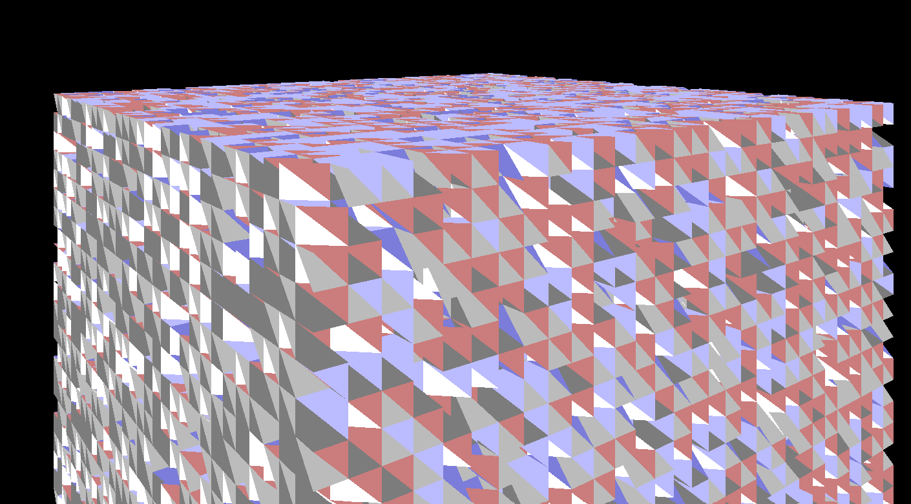

#  Game of Life
A unique take on the game of life



## 2024 Update
This project is a unique take on the game of life that gave me an excuse to try some 3D rust programming back in 2019 and 2020 using [Amethyst](https://github.com/amethyst/amethyst). In 2022 it was rewritten in [Bevy](https://github.com/bevyengine/bevy). Game mechanics are mostly working as of version 0.8.

Version 0.9 is in the works and will include lighting effects, stellar bodies and cleaner code. There is still work to be done on the game machanics.

### Design Patterns
This Game of Life uses the [Bevy](https://github.com/bevyengine/bevy) framework and so utilises the [Entity Component System](https://en.wikipedia.org/wiki/Entity_component_system) paradigm and benefits from Automatic Parameter Resolution for each [System](https://bevy-cheatbook.github.io/programming/systems.html).

## Thanks
To the [bevy cheat book](https://bevy-cheatbook.github.io/). 
To Hill for his work on the tetrahedron. 
To AmionSky's [plugin for wavefront files](https://github.com/AmionSky/bevy_obj/tree/master/example). 
To the official bevy [getting started book](https://bevyengine.org/learn/book/getting-started/resources/). 

## Findings

### Conway's original 2d rules
Universes based on the original Conway's game of life rules have endless entropy when faces and edges are checked for neighbours. If life dies where neighbours are less than 2 or more than 3, and is created where neighbours = 3. There is no stable state, no combination of tetras will remain stable.

### Adjusted rules that allow stable and oscillating states
If the rules are adjusted so life dies where neighbours are less than 3 or more than 4, and is created where neighbours = 4. There are stable states and oscillating states.

## Mathematical Proofs

WIP

### Proof of tessellation

WIP

### Volume
First we can show that our tetrahedron volumes divide neatly into a cube volume. This does not prove tessellation alone.

The volume equation for an irregular tetrahedron is 
```
Volume = sqrt(
    4*u*u*v*v*w*w – u*u*(v*v + w*w – U*U)^2
    – v*v(w*w + u*u – V*V)^2
    – w*w(u*u + v*v – W*W)^2
    + (u*u + v*v – W*W)
    * (w*w + u*u – V*V)
    * (v*v + w*w – U*U)
) / 12
```
Where U,V,W are the edges of the base triangle and u,v,w are the remaining edges. If we put in the following values U= V= W= u= v= w= we get the answer 111111. A cube of sides length 1111 has volume 1111^3 = 3333. Our tetrahedron fits in 333/1111 times exactly.

### Internal angles

We can look at the internal angles of the tetrahedron for each edge and determine the following.

WIP.


### Other FAQS
Q: Why didn't you use half a square based pyramid for your tetrahedrons?
A: This would result in 12 tetrahedrons per cube, which felt too high. I also falsely thought at the time hills tetrahedron could make a cube without mirroring any of the tetrahedron. That however turned out to be incorrect and 3 of the tetrahedron have to be mirrored.

Q: Why tetrahedrons and not cubes?
A: I thought it might give more interesting automata


